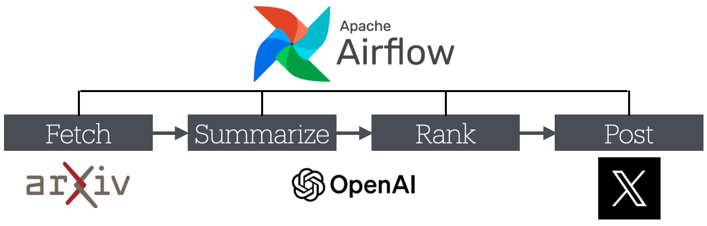

# AI Paper Signal 🤖📄
**매일 쏟아지는 AI 논문 중, 진짜 읽을 만한 것만 골라 올려드립니다**

👉 X(Twitter) 계정: https://x.com/PaperAi27274  
📅 운영 시작: 2026년 2월


## 어떤 프로젝트인가요?

매일 수백 편의 AI 논문이 arXiv라는 논문 사이트에 올라옵니다.  
이 중에서 정말 가치 있는 논문을 사람이 일일이 읽고 고르는 건 사실상 불가능합니다.

**AI Paper Signal**은 이 과정을 자동화한 프로젝트입니다.  
논문을 자동으로 수집하고, AI가 요약·평가한 뒤, 기준을 통과한 논문만 X(Twitter)에 올립니다.  
사람의 개입 없이 24시간 작동합니다.


## 목표

> 하루에 한 번, 읽을 가치가 있는 AI 논문만 골라서 올린다.

단순히 논문을 가져오는 게 아니라, **왜 이 논문이 중요한지**를 AI가 판단하고  
일정한 기준 이상인 것만 발행하는 **품질 필터링 자동화**가 핵심입니다.


## 어떻게 동작하나요?



총 4단계가 순서대로 자동 실행됩니다.

### 1단계 · 수집 (Fetch)
- arXiv에서 AI 관련 최신 논문을 가져옵니다 (AI, 자연어처리, 머신러닝 분야)
- 너무 짧은 초록이나 설문·데이터셋 논문처럼 읽을 가치가 낮은 것은 미리 걸러냅니다

### 2단계 · 요약 (Summarize)
- GPT가 논문 제목과 초록을 읽고 핵심 내용을 짧게 요약합니다
- 전문 용어가 많아도 이해하기 쉬운 문장으로 정리합니다

### 3단계 · 평가 (Rank)
- GPT가 요약된 내용을 바탕으로 논문의 품질을 1~5점으로 채점합니다
- 얼마나 새롭고 실용적인지, 임팩트가 있는지를 기준으로 평가합니다

### 4단계 · 포스팅 (Post)
- 점수가 **4점 이상**인 논문만 X(Twitter)에 자동으로 올립니다
- 요약과 논문 링크를 함께 게시합니다


## 기술 구성

| 역할 | 사용 기술 |
|------|-----------|
| 자동화 스케줄링 | Apache Airflow 2.10.5 |
| 데이터 저장 | SQLite |
| AI 요약·평가 | OpenAI API (gpt-5-mini) |
| 논문 수집 | arXiv API |
| X 포스팅 | X(Twitter) API v2 |


## 파일 구조

```
airflow-local/
├── airflow_home/
│   └── dags/
│       ├── 0_orchestrator_dag.py   # 전체 파이프라인 실행 조율
│       ├── 1_arxiv_fetch_dag.py    # 논문 수집
│       ├── 2_arxiv_summarize_dag.py # AI 요약
│       ├── 3_arxiv_ranking_dag.py  # AI 평가
│       └── 4_arxiv_post_dag.py     # X 포스팅
├── arxiv_pipeline.db               # 수집·요약·평가 결과 저장 DB
└── requirements.txt                # 패키지 목록
```


## 환경 변수 설정

실행 전 아래 환경 변수를 설정해야 합니다.

| 변수명 | 설명 | 기본값 |
|--------|------|--------|
| `OPENAI_API_KEY` | OpenAI API 키 | 필수 |
| `ARXIV_DB_PATH` | DB 파일 경로 | 프로젝트 루트 자동 설정 |
| `ARXIV_SUMMARY_BATCH_SIZE` | 한 번에 요약할 논문 수 | 5 |
| `ARXIV_RANKING_BATCH_SIZE` | 한 번에 평가할 논문 수 | 5 |
| X API 인증 키 4종 | X(Twitter) 포스팅용 | 필수 |
